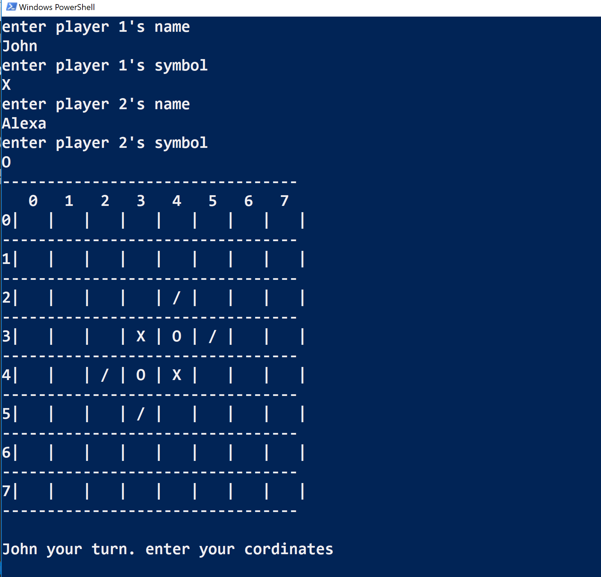
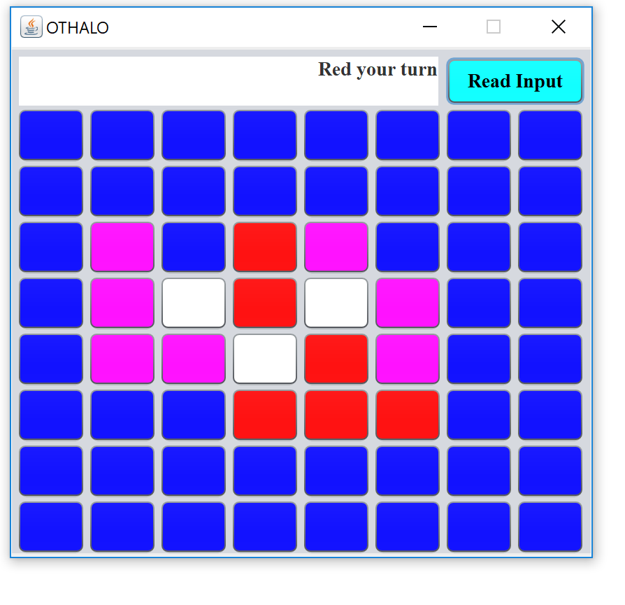

# Othello : A strategic board game

In this game, player aim to make such an arrangement that other player can't move. The player who can't move wins the game.

To know about the rules, [read this wiki page](https://en.wikipedia.org/wiki/Reversi#Rules).

## How to run [Character Based]
1) Open the terminal into the source directory `othello-game`

2) Run  `javac othello/Othello.java`

3) Run  `java othello.Othello`

## How to run [Graphic Based]
1) Open the terminal into the source directory `othello-game`

2) Run  `javac othello/UIClass.java`

3) Run  `java othello.UIClass`

## Screenshots
    

    

## Author
Deepak Aggarwal

Created as a college project in June 2015.
